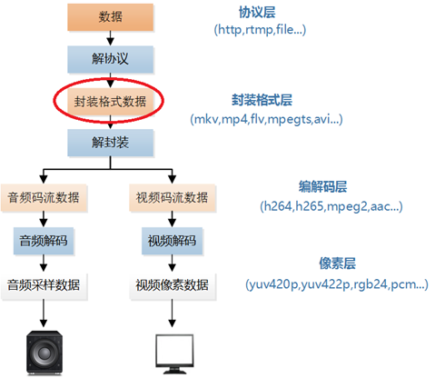

# rtmp_flv   
RTMP接收并分析FLV的sample. 通过librtmp实现从RTMP服务器视音频流拉取, 并自己实现FLV的协议分析(参照FLV的协议标准 "Adobe Flash Video File Format Specification Version 10.1").     

## 阅读与运行 
- `Linux`:   
		`CentOS7 64bit, Kernel 3.10.0-229.el7.x86_64, gcc 4.8.5 20150623`   
	- 编译并安装`librtmp`    
		- 本项目代码中的rtmp拉流部分依赖于`librtmp`实现, `librtmp`为`rtmpdump`工具的一部分, 故需下载并编译安装最新的`rtmpdump`版本, 链接如下:    
			- https://rtmpdump.mplayerhq.hu/    
			- 实验时用的`rtmpdump`版本为`RTMPDump v2.30`    
		
	- 编译运行代码    
	```   
	g++ -std=c++11 FlvHeader.cc FlvCommon.cc  FlvTagHeader.cc FlvTag.cc RTMPSession.cc main.cc -lrtmp   
	./a.out <rtmp_url>  
	```   

## 代码说明   
- main.cc  
入口代码, 调用`RTMPSession`初始化RTMP连接接收码流, 每收到一个RTMP包则通过`FlvHeader`与`FlvTag`进行解析. 接收的同时统计接收码率.   

- RTMPSession.cc/h  
调用`librtmp`初始化RTMP连接, 并通过其接口读取RTMP数据. `librtmp`中已有对于FLV的封装, 每次`Read`都是一个完整的`FlvHeader/FlvTag`.   

- FlvHeader.cc/h   
FLV协议规定, 每个FLV文件/从RTMP服务器拉的FLV流总是以一个`FlvHeader`作为起始. 根据FLV标准定义进行FLV header的解析.   

- FlvTag.cc/h   
FLV协议规定, 第一个FlvHeader过后, 总是一个一个的FlvTag, 音视频数据都在FlvTag中. 根据FLV标准定义进行Flv tag的解析.   

- FlvTagHeader.cc/h   
FLV协议规定, 每个FlvTag, 总是以FlvTagHeader开始. 根据FLV标准进行Flv Tag Header的解析.   

- FlvCommon.cc/h       
此功能中的一些通用功能实现, 包括`FlvException`及时间计算等.   

## 音视频码流层次与Flv标准图例(参考自雷霄骅的blog)   
- 封装格式数据在视频播放器中的位置如下所示   
  

- FLV封装格式是由一个FLV Header文件头和一个一个的Tag组成的。Tag中包含了音频数据以及视频数据。 FLV的结构如下图所示, 具体可参照FLV标准      


## Reference Link:  
- http://blog.csdn.net/leixiaohua1020/article/details/17934487   
- http://blog.csdn.net/leixiaohua1020/article/details/50535082   
- https://rtmpdump.mplayerhq.hu/   
- https://rtmpdump.mplayerhq.hu/librtmp.3.html   


### Contacts   
Author's Email: wangyoucao577@gmail.com.
